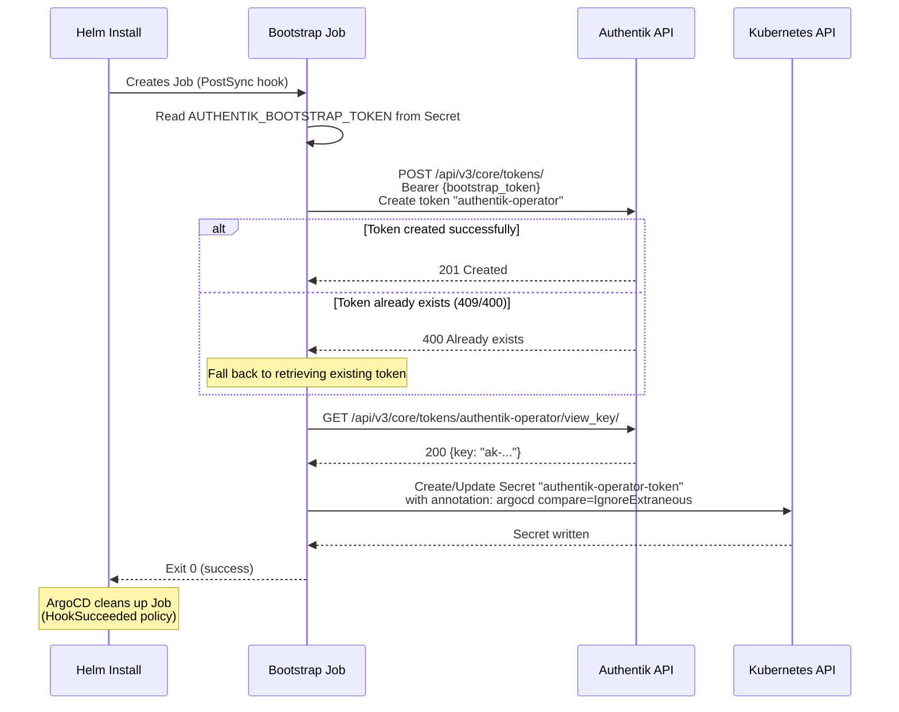

# Bootstrap Token Setup

The operator needs an Authentik API token to query OIDC provider details. The **bootstrap Job**
automates creating this token on first deploy, so you never handle long-lived API keys manually.

---

## How It Works

The bootstrap process has two sides:

1. **Authentik** is started with `AUTHENTIK_BOOTSTRAP_TOKEN` -- a pre-shared token that grants
   initial API access.
2. **The operator's bootstrap Job** uses that pre-shared token to create a dedicated, long-lived
   API token and stores it in a Kubernetes Secret.

After bootstrap completes, the operator reads the API token from the Secret on every
reconciliation loop. The bootstrap token itself is never used again at runtime.

---

## Step 1: Configure Authentik

Set the `AUTHENTIK_BOOTSTRAP_TOKEN` environment variable on your Authentik deployment. This
tells Authentik to accept this token for API authentication.

=== "Authentik Helm Chart"

    ```yaml title="authentik-values.yaml"
    authentik:
      bootstrap_token: "my-secure-bootstrap-token"
    ```

    The official Authentik Helm chart sets `AUTHENTIK_BOOTSTRAP_TOKEN` from this value
    automatically.

=== "Raw Environment Variable"

    ```yaml title="authentik-deployment.yaml"
    env:
      - name: AUTHENTIK_BOOTSTRAP_TOKEN
        value: "my-secure-bootstrap-token"
    ```

!!! warning "Use a strong token"
    The bootstrap token grants full API access to Authentik. Use a long, random string
    (e.g. `openssl rand -hex 32`) and store it securely.

---

## Step 2: Create the Bootstrap Secret in Kubernetes

Create a Kubernetes Secret in the **operator namespace** containing the same token value:

```bash
kubectl create secret generic authentik-bootstrap \
  --from-literal=bootstrap_token="my-secure-bootstrap-token" \
  --namespace authentik-operator
```

The secret name and key must match the Helm values:

```yaml title="values.yaml"
authentik:
  bootstrapSecretRef: authentik-bootstrap    # Secret name
  bootstrapSecretKey: bootstrap_token        # Key within the secret
```

!!! note "Create before installing the operator"
    The bootstrap Secret must exist before the operator Helm chart is installed. The
    bootstrap Job will fail if it cannot find this Secret.

---

## Step 3: Install the Operator

With the bootstrap Secret in place, install the operator chart normally. The bootstrap Job
runs automatically:

```bash
helm install authentik-operator \
  oci://ghcr.io/kettleofketchup/authentik-operator \
  --version 0.1.2 \
  --set authentik.url=https://auth.example.com \
  --namespace authentik-operator
```

---

## Bootstrap Flow

The following diagram shows the complete bootstrap sequence:



---

## What the Bootstrap Job Creates

The Job creates a Secret named `authentik-operator-token` (configurable via `tokenSecretName`)
in the operator namespace:

```yaml title="Generated Secret"
apiVersion: v1
kind: Secret
metadata:
  name: authentik-operator-token
  namespace: authentik-operator
  annotations:
    argocd.argoproj.io/compare-options: IgnoreExtraneous
type: Opaque
data:
  token: <base64-encoded Authentik API key>
```

The `IgnoreExtraneous` annotation prevents ArgoCD from pruning this out-of-band resource.

---

## Troubleshooting

### Bootstrap Job fails with authentication error

**Symptom:** Job logs show `401 Unauthorized` or `403 Forbidden`.

**Causes:**

- The `AUTHENTIK_BOOTSTRAP_TOKEN` value in the K8s Secret does not match the token configured
  on the Authentik instance.
- The Authentik instance was not restarted after setting `AUTHENTIK_BOOTSTRAP_TOKEN`.

**Fix:** Verify the token values match, restart Authentik if needed, then re-run bootstrap.

### Bootstrap Job cannot reach Authentik

**Symptom:** Job logs show connection refused or DNS resolution failures.

**Causes:**

- The `authentik.url` value is incorrect or unreachable from the operator namespace.
- Authentik is not yet running (deployment order issue).

**Fix:** Confirm the URL is correct and that Authentik pods are running. If using ArgoCD,
ensure Authentik is in an earlier sync wave than the operator.

### Bootstrap Job fails with TLS certificate error

**Symptom:** Job logs show `x509: certificate signed by unknown authority`.

**Causes:**

- Authentik is behind an internal CA (e.g., a self-signed or private CA certificate).
- The operator does not trust the CA that signed Authentik's TLS certificate.

**Fix:** Provide the CA certificate via Helm values. The bootstrap Job shares the same TLS
configuration as the operator. See [TLS Configuration](configuration.md#tls-configuration)
for details.

```yaml title="values.yaml"
authentik:
  url: https://auth.example.com
  tls:
    caSecretRef: my-ca-cert-secret
    caSecretKey: ca.crt
```

For quick debugging, you can temporarily disable TLS verification:

```yaml title="values.yaml (debugging only)"
authentik:
  tls:
    insecureSkipVerify: true
```

### Token secret already exists

The bootstrap Job handles this gracefully. If the token `authentik-operator` already exists in
Authentik, the Job retrieves the existing key instead of creating a new one.

### Re-running bootstrap

To force a fresh bootstrap (e.g. after rotating the Authentik bootstrap token):

1. Delete the existing API token secret:

    ```bash
    kubectl delete secret authentik-operator-token -n authentik-operator
    ```

2. Optionally delete the existing token in Authentik via the admin UI
   (under **Directory > Tokens**, find `authentik-operator`).

3. Re-run the bootstrap Job:

    === "ArgoCD"

        Trigger a sync -- the PostSync hook will re-run automatically.

    === "Helm"

        ```bash
        # Uninstall and reinstall, or delete the Job and upgrade:
        kubectl delete job authentik-operator-bootstrap -n authentik-operator
        helm upgrade authentik-operator \
          oci://ghcr.io/kettleofketchup/authentik-operator \
          --version 0.1.2 \
          -f values.yaml \
          --namespace authentik-operator
        ```

### Synchronizing the bootstrap token across namespaces

If your Authentik instance and the operator run in different namespaces, you need the same bootstrap token value in both places. Instead of creating the secret manually in the operator namespace, use a **secret reflector** to automatically mirror it.

#### Using Ember Stack Reflector

[Reflector](https://github.com/emberstack/kubernetes-reflector) watches secrets with specific annotations and mirrors them to other namespaces.

**1. Install Reflector:**

```bash
helm install reflector emberstack/reflector --namespace kube-system
```

**2. Annotate the source secret in the Authentik namespace:**

```yaml title="authentik-bootstrap-secret.yaml"
apiVersion: v1
kind: Secret
metadata:
  name: authentik-bootstrap
  namespace: authentik
  annotations:
    reflector.v1.k8s.emberstack.com/reflection-allowed: "true"
    reflector.v1.k8s.emberstack.com/reflection-allowed-namespaces: "authentik-operator"
    reflector.v1.k8s.emberstack.com/reflection-auto-enabled: "true"
    reflector.v1.k8s.emberstack.com/reflection-auto-namespaces: "authentik-operator"
type: Opaque
stringData:
  bootstrap_token: "my-secure-bootstrap-token"
```

```bash
kubectl apply -f authentik-bootstrap-secret.yaml
```

Reflector will automatically create and maintain a copy of this secret in the `authentik-operator` namespace. When the source secret changes, the reflected copy updates automatically.

!!! tip "Single source of truth"
    With this approach, you only manage the bootstrap token in one place (the `authentik` namespace).
    The reflected copy stays in sync automatically — no manual duplication required.

#### Using Mittwald Kubernetes Replicator

[kubernetes-replicator](https://github.com/mittwald/kubernetes-replicator) is an alternative that uses a similar annotation pattern:

```yaml title="authentik-bootstrap-secret.yaml"
apiVersion: v1
kind: Secret
metadata:
  name: authentik-bootstrap
  namespace: authentik
  annotations:
    replicator.v1.mittwald.de/replicate-to: "authentik-operator"
type: Opaque
stringData:
  bootstrap_token: "my-secure-bootstrap-token"
```

#### Using Reflector in an ArgoCD / GitOps workflow

If you manage secrets declaratively via Sealed Secrets or External Secrets Operator, annotate the
generated secret resource. For example, with External Secrets:

```yaml title="external-secret.yaml"
apiVersion: external-secrets.io/v1beta1
kind: ExternalSecret
metadata:
  name: authentik-bootstrap
  namespace: authentik
spec:
  target:
    template:
      metadata:
        annotations:
          reflector.v1.k8s.emberstack.com/reflection-allowed: "true"
          reflector.v1.k8s.emberstack.com/reflection-allowed-namespaces: "authentik-operator"
          reflector.v1.k8s.emberstack.com/reflection-auto-enabled: "true"
          reflector.v1.k8s.emberstack.com/reflection-auto-namespaces: "authentik-operator"
  secretStoreRef:
    name: vault-backend
    kind: ClusterSecretStore
  data:
    - secretKey: bootstrap_token
      remoteRef:
        key: authentik/bootstrap
        property: token
```

!!! warning "Namespace must exist first"
    The target namespace (`authentik-operator`) must exist before the reflector can mirror
    the secret into it. Create the namespace before installing the operator chart, or use
    `--create-namespace` on the Helm install.

---

### Disabling bootstrap entirely

If you prefer to create the API token manually:

```yaml title="values.yaml"
bootstrap:
  enabled: false
```

Then create the token secret yourself:

```bash
kubectl create secret generic authentik-operator-token \
  --from-literal=token="ak-your-api-token-here" \
  --namespace authentik-operator
```


