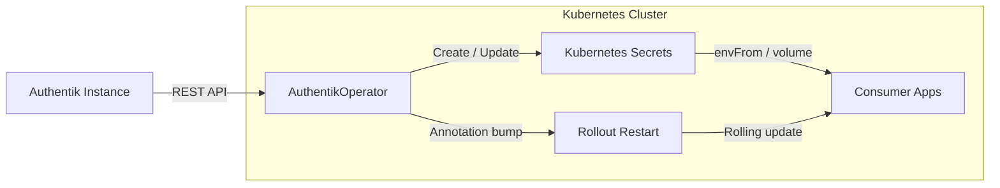

# AuthentikOperator

**Automatically sync OIDC credentials from Authentik into Kubernetes Secrets.**

AuthentikOperator is a Kubernetes operator that eliminates the manual, error-prone process of copying OIDC client IDs, secrets, and endpoint URLs from Authentik into the Kubernetes Secrets your applications consume. Define an `OIDCClient` custom resource, and the operator handles the rest -- fetching credentials from the Authentik API, writing them into correctly-formatted Secrets, and optionally restarting your workloads when credentials change.

---

## Why AuthentikOperator?

If you run Authentik as your identity provider across multiple applications in Kubernetes, you know the pain:

- **Secret sprawl** -- every application needs its own Secret with OIDC credentials, each with different environment variable naming conventions.
- **Manual copying** -- after creating an OIDC provider in Authentik, you have to manually extract the `client_id` and `client_secret` and create Kubernetes Secrets by hand.
- **Drift and staleness** -- secrets get out of sync when providers are rotated, and there is no feedback loop to detect it.
- **No restart automation** -- even after updating a Secret, pods do not pick up the new values until manually restarted.

AuthentikOperator solves all of these problems declaratively.

---

## Key Features

- **Automatic credential sync** -- the operator reads OIDC provider details from the Authentik API and writes them into Kubernetes Secrets, keeping them in sync on every reconciliation cycle.
- **Built-in secret profiles** -- profiles for `grafana`, `openwebui`, `argocd`, and `generic` map Authentik OIDC data to the exact environment variable names each application expects.
- **Secret overrides** -- add application-specific settings (like Grafana role mapping expressions) by merging extra keys on top of any profile.
- **Rollout restart** -- optionally trigger a rolling restart of a Deployment or StatefulSet when the Secret content changes, so pods pick up new credentials without manual intervention.
- **Bootstrap job** -- a one-time Job automatically creates the operator's own Authentik API token on first deploy, so there is no manual token setup required.
- **Hash-based change detection** -- the operator computes a SHA256 hash of Secret data and skips writes when nothing has changed, avoiding unnecessary updates.

---

## Quick Start

### Install with Helm



!!! note
    You must create the bootstrap secret before installing. See the [Prerequisites](getting-started/prerequisites.md) page for details.

### Create an OIDCClient

```yaml title="grafana-oidc.yaml"
apiVersion: auth.kettleofketchup/v1alpha1
kind: OIDCClient
metadata:
  name: grafana-oidc
spec:
  authentik:
    applicationSlug: grafana
  target:
    namespace: monitoring
    secretName: grafana-oauth
  secretProfile: grafana
```

```bash
kubectl apply -f grafana-oidc.yaml
```

The operator will fetch the Grafana OIDC provider details from Authentik, map them to Grafana's expected environment variable names, and create the `grafana-oauth` Secret in the `monitoring` namespace.

---

## Architecture



### Reconciliation Flow

For each `OIDCClient` custom resource, the operator:

1. **Fetches** the OIDC provider from Authentik via the application slug
2. **Builds** the Secret data using the selected profile and any overrides
3. **Compares** the computed hash against the last-synced hash
4. **Writes** the Secret if data has changed (create or update)
5. **Triggers** a rollout restart if enabled and the Secret changed
6. **Updates** the CR status with conditions and the last sync time

!!! tip
    The operator never deletes an existing Secret if Authentik is temporarily unreachable. Credentials remain stable even during Authentik downtime.

---

## Next Steps

- [Prerequisites](getting-started/prerequisites.md) -- set up Authentik and the bootstrap secret
- [Quick Start](getting-started/quickstart.md) -- step-by-step guide from zero to working
