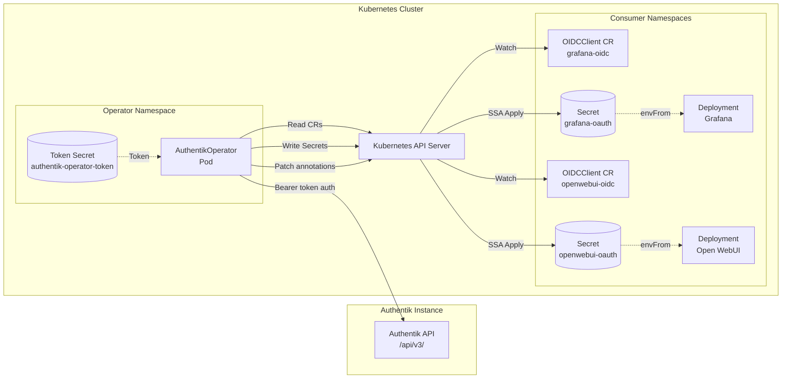

# Architecture

This page describes the system architecture, reconciliation loop, project structure, and key design decisions behind AuthentikOperator.

---

## System Architecture

The operator sits between an Authentik identity provider and Kubernetes consumer workloads. It reads OIDC credentials from the Authentik API and writes them as Kubernetes Secrets into the namespaces where consumer applications expect them.



---

## Reconciliation Loop

Each OIDCClient CR is reconciled on a configurable interval (default: 5 minutes). The loop follows six steps:

```mermaid
sequenceDiagram
    participant K8s as Kubernetes API
    participant Op as Operator
    participant Auth as Authentik API

    Note over Op: Reconcile triggered<br/>(watch event or timer)

    Op->>K8s: 1. Get OIDCClient CR
    K8s-->>Op: CR spec

    rect rgb(40, 40, 60)
        Note over Op,Auth: Step 2: Fetch (two-step lookup)
        Op->>Auth: GET /api/v3/core/applications/{slug}/
        Auth-->>Op: Application (PK)
        Op->>Auth: GET /api/v3/providers/oauth2/?application={pk}
        Auth-->>Op: Provider (clientId, clientSecret)
    end

    Note over Op: 3. Build secret data<br/>Apply profile + overrides<br/>Compute SHA256 hash

    Op->>K8s: 4. Compare hash with status.secretHash

    alt Hash unchanged
        Note over Op: No-op, requeue
    else Hash changed or Secret missing
        Op->>K8s: 5. Server-side Apply target Secret<br/>(field manager: authentik-operator)

        opt rolloutRestart.enabled
            Op->>K8s: 6a. Patch Deployment/StatefulSet<br/>annotation with new hash
        end

        Op->>K8s: 6b. Update CR status<br/>(conditions, lastSyncTime, secretHash)
    end

    Note over Op: Requeue after<br/>reconcileInterval
```



### Error Handling

| Scenario | Behavior |
|----------|----------|
| Authentik unreachable | Set `AuthentikProviderFound: False`, requeue with backoff |
| Provider not found for slug | Set condition `False`, emit event, requeue at normal interval |
| Target namespace does not exist | Set `SecretSynced: False`, emit event |
| Secret write fails | Set `SecretSynced: False`, requeue |
| Rollout patch fails | Set `RolloutTriggered: False`, continue (non-fatal) |

!!! info "Never Destructive"
    The operator never deletes an existing Secret if Authentik is temporarily unavailable. Credentials remain in place until a successful sync produces new data.

---

## Project Structure

```
AuthentikOperator/
├── api/v1alpha1/                # CRD type definitions
│   ├── groupversion_info.go     #   API group registration
│   ├── oidcclient_types.go      #   OIDCClient spec, status, markers
│   └── zz_generated.deepcopy.go #   Generated DeepCopy methods
├── cmd/
│   └── main.go                  # Entrypoint: manager + bootstrap mode
├── internal/
│   ├── authentik/               # Authentik API HTTP client
│   │   ├── client.go            #   Two-step provider lookup, token creation
│   │   ├── client_test.go       #   HTTP mock tests
│   │   └── types.go             #   API response structs
│   ├── bootstrap/               # Bootstrap Job logic
│   │   ├── bootstrap.go         #   Token creation + K8s secret write
│   │   └── bootstrap_test.go
│   ├── controller/              # Reconciler
│   │   ├── oidcclient_controller.go      # Main reconcile loop
│   │   ├── oidcclient_controller_test.go # Envtest integration tests
│   │   └── suite_test.go                 # Ginkgo test suite setup
│   ├── hash/                    # Deterministic secret hashing
│   │   ├── hash.go              #   SHA256 with sorted keys
│   │   └── hash_test.go
│   ├── profiles/                # Secret profile mappings
│   │   ├── profiles.go          #   grafana, openwebui, argocd, generic
│   │   ├── profiles_test.go
│   │   └── types.go             #   OIDCData struct + URL builder
│   └── rollout/                 # Deployment/StatefulSet restart trigger
│       ├── rollout.go           #   Annotation-based rolling restart
│       └── rollout_test.go
├── chart/                       # Helm chart
│   ├── Chart.yaml
│   ├── values.yaml
│   ├── crds/                    #   CRD YAML (installed by Helm)
│   └── templates/               #   Deployment, RBAC, bootstrap Job
├── config/                      # Kubebuilder Kustomize manifests
│   ├── crd/                     #   Generated CRD bases
│   ├── rbac/                    #   ClusterRole, bindings, leader election
│   ├── manager/                 #   Manager deployment
│   └── samples/                 #   Example OIDCClient CR
├── docs/                        # MkDocs documentation
├── test/e2e/                    # End-to-end tests
├── Makefile                     # Kubebuilder build system
├── justfile                     # Just task runner (wraps Make)
└── Dockerfile                   # Multi-stage operator image
```

---

## Key Design Decisions

### Why Kubebuilder

!!! info "Design Decision"
    **Kubebuilder v4 with controller-runtime** was chosen over writing a controller from scratch with `client-go`.

    Kubebuilder provides:

    - Scaffolded project structure with clear conventions
    - Automatic CRD generation from Go types via `controller-gen`
    - Built-in leader election, health probes, and metrics
    - Envtest integration for controller tests without a real cluster
    - RBAC marker comments that generate ClusterRole YAML

    The trade-off is a larger dependency tree, but the development velocity and reduced boilerplate far outweigh that cost for a single-CRD operator.

### Why Profiles Instead of Raw Key Mapping

!!! info "Design Decision"
    **Built-in profiles** (`grafana`, `openwebui`, `argocd`, `generic`) handle the mapping from OIDC source data to application-specific Secret keys, rather than requiring users to specify key mappings in every CR.

    Benefits:

    - CRs stay concise -- a single `secretProfile: grafana` replaces 8+ key mappings
    - Profile logic is tested in Go, not scattered across YAML
    - The `secretOverrides` escape hatch allows adding or replacing any key
    - New profiles are added by implementing a single function in `internal/profiles/`

    The `generic` profile serves as a passthrough for applications not yet covered by a named profile.

### Why Cross-Namespace Secrets with Labels

!!! info "Design Decision"
    The operator writes Secrets to **any namespace** in the cluster, not just the namespace where the OIDCClient CR lives. Kubernetes does not support cross-namespace `ownerReferences`, so the operator uses **labels** for tracking:

    ```yaml
    labels:
      auth.kettleofketchup/managed-by: authentik-operator
      auth.kettleofketchup/oidc-client: <cr-name>
    ```

    This means:

    - The operator can find its managed Secrets via label selectors
    - Secrets are not garbage-collected when the CR is deleted (intentional -- credentials should persist until explicitly removed)
    - Future cleanup can be implemented via finalizers

### Why Bearer Token Bootstrap

!!! info "Design Decision"
    The bootstrap Job uses **Bearer token authentication** (Authentik's `AUTHENTIK_BOOTSTRAP_TOKEN`) rather than Basic auth or other methods.

    Reasons:

    - Authentik does not support Basic auth on its API
    - The bootstrap token is a pre-shared secret set as an environment variable on the Authentik instance at deploy time
    - The bootstrap flow creates a dedicated API token with `api` intent, then stores it in a Kubernetes Secret for the operator to use at runtime
    - The bootstrap token is only used once; the long-lived API token handles all subsequent requests

### Why Server-Side Apply and ArgoCD Annotations

!!! info "Design Decision"
    The operator uses **Kubernetes server-side apply (SSA)** with field manager `authentik-operator` to write secrets, rather than the traditional Create/Update pattern.

    Benefits:

    - **Field ownership** -- Kubernetes tracks which fields belong to the operator vs other managers (e.g., ArgoCD). Each manager only owns the fields it applies.
    - **ArgoCD coexistence** -- When ArgoCD also manages a secret (e.g., `argocd-secret`), SSA prevents conflicts. ArgoCD owns its fields, the operator owns its fields, and neither overwrites the other.
    - **No `ignoreDifferences` needed** -- Users no longer need to add `ignoreDifferences` with `jsonPointers` to their ArgoCD Application specs.
    - **Simpler code** -- SSA handles create-or-update in a single `Apply()` call, eliminating the Get/IsNotFound/Create/Update branching.

    All operator-managed secrets also receive the `argocd.argoproj.io/compare-options: IgnoreExtraneous` annotation as a safety net for ArgoCD deployments that do not use `ServerSideApply=true`.

### Why Two-Step Authentik API Lookup

!!! info "Design Decision"
    Fetching an OAuth2 provider requires **two API calls**:

    1. `GET /api/v3/core/applications/{slug}/` -- get the application by slug, extract its PK
    2. `GET /api/v3/providers/oauth2/?application={pk}` -- get the provider by application PK

    This is necessary because the Authentik providers endpoint does **not** support filtering by `application__slug`. The application slug is the user-friendly identifier, but the provider is linked to the application by its PK (a UUID). The two-step lookup is encapsulated in `Client.GetOAuth2ProviderBySlug()`.

---

## Deployment Order

The following deployment sequence ensures all dependencies are available when needed:

1. **Authentik** deploys and applies blueprints (creates OIDC providers and applications)
    - ArgoCD sync wave: `-3` or lower
2. **Bootstrap Secret** -- the `authentik-bootstrap` Kubernetes Secret containing the shared `AUTHENTIK_BOOTSTRAP_TOKEN` must exist in the operator namespace
    - Created manually or via a sealed secret, sync wave: `-2`
3. **AuthentikOperator** chart deploys (operator Deployment + CRD + RBAC)
    - ArgoCD sync wave: `-1`
4. **Bootstrap Job** runs as an ArgoCD PostSync hook, creating the API token Secret
5. **OIDCClient CRs** are created by consumer application charts
    - Can deploy before the operator -- the operator reconciles when ready
    - ArgoCD sync wave: `0` (default)
6. **Operator reconciles** -- reads Authentik, writes Secrets to target namespaces
7. **Consumer pods** start (or restart via rollout) with OIDC credentials mounted

!!! tip "Eventual Consistency"
    The operator's retry/requeue loop handles eventual consistency naturally. OIDCClient CRs created before the operator is ready will be reconciled as soon as the operator starts. Strict sync-wave ordering is helpful but not mandatory.

---

## RBAC Model

The operator requires a ClusterRole with the following permissions:

| API Group | Resources | Verbs | Purpose |
|-----------|-----------|-------|---------|
| `""` (core) | `secrets` | `get`, `list`, `watch`, `create`, `update`, `patch` | Read the API token secret; create and update OIDC credential secrets in any namespace. |
| `""` (core) | `events` | `create`, `patch` | Emit Kubernetes events for reconciliation status. |
| `apps` | `deployments`, `statefulsets` | `get`, `update`, `patch` | Patch pod template annotations to trigger rollout restarts. |
| `auth.kettleofketchup` | `oidcclients` | `get`, `list`, `watch`, `create`, `update`, `patch`, `delete` | Full access to the OIDCClient custom resource. |
| `auth.kettleofketchup` | `oidcclients/status` | `get`, `update`, `patch` | Update status subresource (conditions, lastSyncTime, secretHash). |
| `auth.kettleofketchup` | `oidcclients/finalizers` | `update` | Update finalizers for future cleanup support. |
| `coordination.k8s.io` | `leases` | `get`, `list`, `watch`, `create`, `update`, `patch`, `delete` | Leader election when running multiple replicas. |

!!! warning "Cluster-Scoped RBAC"
    The operator uses a **ClusterRole** (not a namespaced Role) because it must create Secrets in arbitrary namespaces and read OIDCClient CRs across the cluster. The Helm chart creates both the ClusterRole and ClusterRoleBinding automatically.

*[CRD]: Custom Resource Definition
*[CR]: Custom Resource
*[OIDC]: OpenID Connect
*[RBAC]: Role-Based Access Control
*[K8s]: Kubernetes
*[IdP]: Identity Provider
*[ArgoCD]: Argo Continuous Delivery
